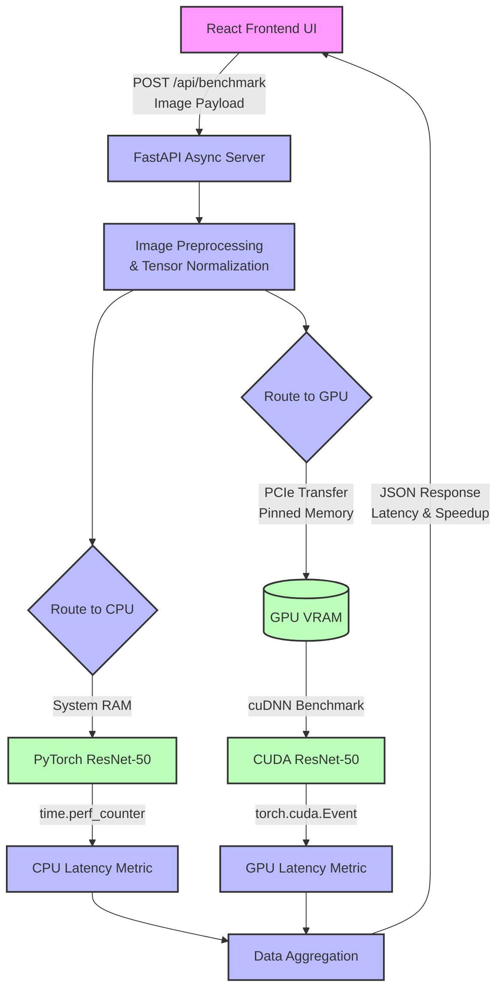

# 3. System Architecture

To fulfill the dual requirements of providing a highly responsive user experience and executing mathematically rigorous, timing-sensitive hardware benchmarks, DeepAccel is architected as a fully decoupled, full-stack application. The system strictly separates the presentation layer from the computational engine, ensuring that the heavy lifting of tensor manipulation and GPU synchronization does not block or degrade the user interface. 

The architecture is broadly divided into two primary domains: a high-performance, asynchronous computational backend driven by Python and FastAPI, and a dynamic, client-side visualizer constructed with React.

## 3.1 Backend Computational Engine
The backend serves as the nerve center of the DeepAccel framework. It is responsible for data ingestion, model orchestration, memory management, and—most critically—the precise, microsecond-accurate timing of the inference workloads. 

We selected **FastAPI** as the foundational web framework due to its native support for asynchronous programming (via Python's `asyncio`) and its exceptionally low operational overhead. When a user submits a benchmarking request, the FastAPI event loop ensures that the server can continue accepting incoming connections while the heavy inference task is dispatched to a background thread pool, preventing pipeline stalls.

### 3.1.1 Model Orchestration and Context Isolation
At the core of the benchmarking logic is the integration with **PyTorch**, the industry standard for deep learning research and deployment. Upon server initialization, the backend provisions a pre-trained deep convolutional neural network. For our standard benchmarks, we utilize ResNet-50, instantiated from the `torchvision` library, due to its substantial parameter count and heavy reliance on spatial convolutions.

To guarantee a fair and mathematically sound benchmark, the system is designed to maintain two strictly isolated execution contexts:
1.  **The CPU Context**: A pristine instance of the model is loaded entirely into the host's system memory (RAM). When an inference request is routed to this context, PyTorch utilizes the CPU's cores. To maximize throughput, PyTorch is configured to utilize Intel MKL (Math Kernel Library) or OpenBLAS, ensuring that the CPU is leveraging vectorized instructions (like AVX2 or AVX-512) to the best of its ability.
2.  **The GPU Context (CUDA/cuDNN)**: A duplicate instance of the model is explicitly mapped to the GPU's Video RAM (VRAM) via the PCIe bus. In this context, PyTorch acts as an orchestrator for NVIDIA's cuDNN library. We explicitly enable the `torch.backends.cudnn.benchmark = True` flag. This is a critical architectural decision. It instructs cuDNN to spend a fraction of a second during the first forward pass (the "warm-up" phase) exhaustively benchmarking different internal convolution algorithms (e.g., implicit GEMM, Winograd, or FFT) against the specific geometry of the input tensor. It then caches the fastest algorithmic path for all subsequent inference requests.

### 3.1.2 The PCIe Bottleneck and Memory Pinning
One of the most significant challenges in deep learning benchmarking is differentiating between execution time and data transfer time. The GPU is a remarkably fast calculator, but feeding it data over the Peripheral Component Interconnect Express (PCIe) bus is comparatively slow. If a benchmarking tool simply measures the time from when a function is called in Python to when it returns, it is inadvertently including the time it took to copy the image tensor from system RAM to GPU VRAM.

To mitigate this, DeepAccel's architecture can utilize **Page-Locked (Pinned) Memory**. By allocating the input tensor in pinned memory (`tensor.pin_memory()`), the host CPU is prevented from swapping that memory to the hard drive. This allows the GPU's Direct Memory Access (DMA) controller to asynchronously pull the data across the PCIe bus with significantly higher bandwidth and lower latency. DeepAccel explicitly separates the timing of this data transfer phase from the actual execution phase, ensuring the final metrics reflect pure ALUs-in-motion.

### 3.1.3 Precision Timing Methodologies
GPU operations are inherently asynchronous. When a Python script instructs PyTorch to perform a convolution on the GPU, the CPU dispatches the kernel to the GPU's command queue and immediately returns, continuing to the next line of code long before the GPU has actually finished the math. Consequently, using standard Python timing libraries like `time.time()` will result in catastrophic inaccuracies, recording only the kernel *dispatch* time (typically a few microseconds) rather than the kernel *execution* time.

DeepAccel circumvents this by utilizing `torch.cuda.Event` markers with explicit synchronization. 
The architectural flow for a single benchmark is as follows:
1.  An event `start_event` is recorded in the CUDA stream.
2.  The forward inference pass is dispatched.
3.  An event `end_event` is recorded.
4.  The CPU explicitly halts and waits using `torch.cuda.synchronize()`, guaranteeing all operations in the GPU queue have completed.
5.  The elapsed time is calculated natively by the CUDA runtime via `start_event.elapsed_time(end_event)`, yielding microsecond-level accuracy.

---
### Guidance: Generating Architecture Diagrams
To visually represent this architecture in an IEEE paper, researchers often use tools like **Draw.io** or **Mermaid.js**. Below is an example of a Mermaid flowchart that can be directly embedded into Markdown or exported as an SVG for publication. It illustrates the exact decoupled flow described above.

*(Figure 1: High-level system architecture of the DeepAccel framework, demonstrating the isolated execution paths and precision timing integrations.)*

## 3.2 Frontend Visualization Client
The presentation layer is built utilizing **React**, scaffolded via the **Vite** build tool for near-instantaneous Hot Module Replacement (HMR) during development. The design philosophy of the frontend is anchored in immediate visual feedback. 

When the JSON payload containing the benchmarking metrics is received from the FastAPI backend, the React state management system triggers a re-render. We eschew heavy charting libraries in favor of custom, mathematically scaled Vanilla CSS elements. This ensures that the rendering of the comparative bar charts—illustrating the CPU latency versus the GPU latency—is instantaneous and visually arresting. The application dynamically calculates the speedup multiplier ($S = \frac{T_{cpu}}{T_{gpu}}$) and presents it prominently, ensuring the user immediately grasps the magnitude of the hardware acceleration.
