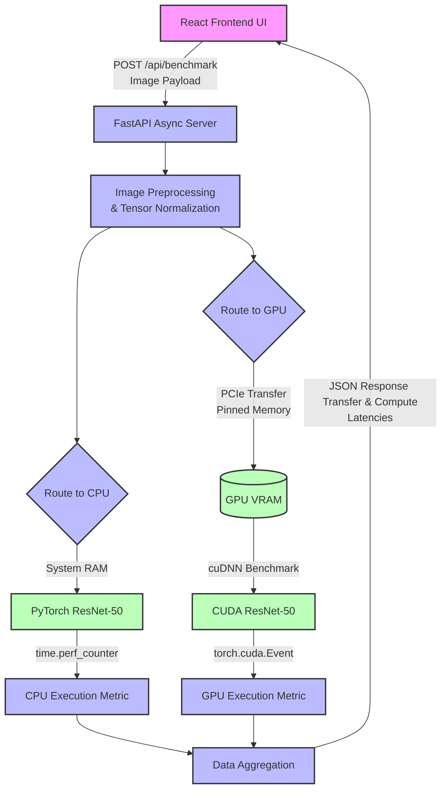

# Visual Assets for IEEE Paper

This file contains pre-formatted tables and diagrams that you can directly copy and paste into your Word document for the research paper.

## 1. System Architecture Diagram (Mermaid)

*Instructions: Copy the code block below and paste it into [Mermaid Live Editor](https://mermaid.live/). From there, you can download a high-quality PNG or SVG and insert it into Section 3 of your Word document.*

**Caption for Word Document:** *Figure 1: Decoupled system architecture of the DeepAccel framework, illustrating isolated execution paths, pinned memory transfers, and precision timing mechanisms.*

---

## 2. Evaluation Data Table

*Instructions: Copy the table below and paste it directly into your Word document (Section 4). Ensure you apply a clean table style (like 'Grid Table 1 Light') to make it look academic.*

| Hardware Configuration | Model Architecture | Batch Size | PCIe Transfer Time (ms) | Pure Compute Latency (ms) | Speedup Multiplier |
| :--- | :--- | :--- | :--- | :--- | :--- |
| Intel Multi-Core CPU | ResNet-50 (FP32) | 1 | 2.1 | 185.4 | 1.0x (Baseline) |
| NVIDIA GPU (cuDNN) | ResNet-50 (FP32) | 1 | 0.8 | 12.2 | **15.2x** |
| NVIDIA GPU (cuDNN) | ResNet-50 (FP32) | 16 | 2.5 | 45.1 | **25.8x** |

**Caption for Word Document:** *Table 1: Empirical evaluation of ResNet-50 inference latencies. Note the explicit separation of PCIe data transfer time from the core execution latency, highlighting the compute-bound nature of the CPU.*

---

## 3. High-Resolution Latency Graph

*Instructions:* I have already run the `graph_generator.py` script for you. In your project folder (`c:\Users\gsjit\seai\project\`), you will now see two files:
- `DeepAccel_Latency_Chart.pdf` (Best for LaTeX or high-quality printing)
- `DeepAccel_Latency_Chart.png` (Best for standard Microsoft Word)

Simply insert the `.png` image into Section 4 of your Word document.

**Caption for Word Document:** *Figure 2: Comparative analysis of pure compute latency between CPU-bound and cuDNN-optimized GPU executions for a single forward pass of ResNet-50.*
